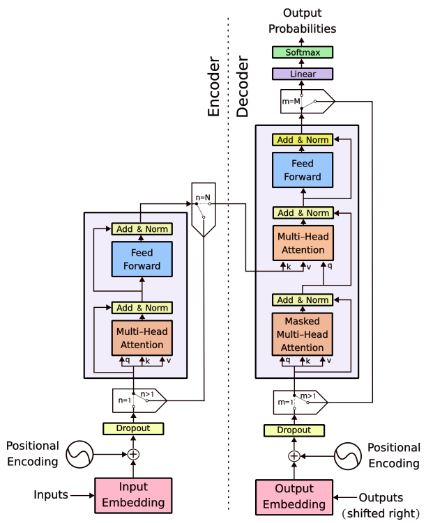

# Attention Is All You Need 

[](https://opensource.org/licenses/MIT)
[](https://www.python.org/downloads/)
[](https://pytorch.org/)



# Transformer — An Educational Implementation

This repository provides an **educational, implementation-oriented view of the Transformer architecture**, originally introduced in *"Attention Is All You Need"* (Vaswani et al., 2017).  
To make the model more approachable, the architecture has been redrawn with additional **implementation-level details**, so that each block in the diagram directly corresponds to components in the code. This helps bridge the gap between the abstract architecture and its practical realization.

## ✨ Project Highlights

- **From-Scratch PyTorch Implementation**  
  A clear and minimal implementation of the Transformer model, written with readability in mind so learners can easily follow each step.

- **Practical Translation Example**  
  Demonstrates the Transformer in action on a **German → English translation task** using the IWSLT 2017 dataset.

- **GPU-Friendly Configuration**  
  Includes a configuration file adapted for training on a consumer GPU with **24 GB VRAM** (e.g., NVIDIA RTX 3090).

- **Masking Techniques Explained**  
  The implementation carefully explains and demonstrates the different types of masks required for batched training:  
  - **Padding masks** (to ignore `<pad>` tokens).  
  - **Causal masks** (to preserve autoregressive decoding).  
  - **Encoder–decoder attention masks** (to align source and target sequences).  

## Goal

The main goal of this project is to serve as an **educational reference**: not just to provide a working Transformer implementation, but to explain **why each part exists and how it works together**.

## Getting Started

In order to setup this repo locally take the following steps.

### Prerequisites

Ensure you have the following installed:

* Python (>= 3.10)
* PyTorch (>= 2.1)
* CUDA (if you intend to use GPU acceleration)
* Other required Python packages (install via `pip install -r requirements.txt`)

### Installation

1.  Clone the repository:
    ```bash
    git clone https://github.com/Rasoul77/transformer-from-scratch.git
    
    cd transformer-from-scratch
    ```

2.  Install the required Python packages:
    ```bash
    pip install -r requirements.txt
    ```

### 📂 Repository Structure
```
.
├── config
│   └── de_en
│       └── config_de_en.yaml  # Example configuration file
├── model.py      # Transformer model implementation
├── tokenizer.py  # Script to build SentencePiece tokenizers
├── trainer.py    # Training pipeline (data, optimizer, masks)
├── train.py      # Entry point for training
├── translate.py  # Script for inference (translation)
└── utility
    └── utils.py  # Helper functions
```

### Usage
This section explains steps to successfully run the pipeline from creating tokenizers towards using the trained model and tokenizers to translate the input language.

#### Train Tokenizers
First you need to create custom tokenizers for the input/output languages. This script demonstrates how one can create tokenizers. This script creates a folder named `tokenizer_models` and saves tokenizers.
```bash
cd code
python3 tokenizer.py --config_path config/de_en/config_de_en.yaml
```

#### Train the Model
Having the tokenizers trained, now we start training the transformer model for the language translation task.
```bash
cd code
python3 train.py --config_path config/de_en/config_de_en.yaml

```
Optionally, enable Weights & Biases logging:
```bash
cd code
python3 tokenizer.py --config_path config/de_en/config_de_en.yaml --use_wandb --wandb_project "Transformer-DE-EN"
```

The trained model will be saved in a folder named `checkpoints` with the corresponding config yaml file.

#### Translate Sentences (Inference)
In order to test the trained model, an inference script named `translate.py` is provided. In order to use it, you need to specify the checkpoint folder as the argument.
```bash
cd code
python3 translate.py --checkpoint_path checkpoints/<pre_trained_folder_name>

```
This script loads the model, and initiates an interactive loop example:
```
DE: Das ist ein Test.
EN: This is a test.
```

### Configuration

The project utilizes YAML files for configuration. You can find example configuration files in the `code/config` directory.

* `code/config/de_en/config_de_en.yaml`: Contains an example configuration for German to English translation using the IWSLT 2017 dataset, and settings for the model, training and evaluation.


